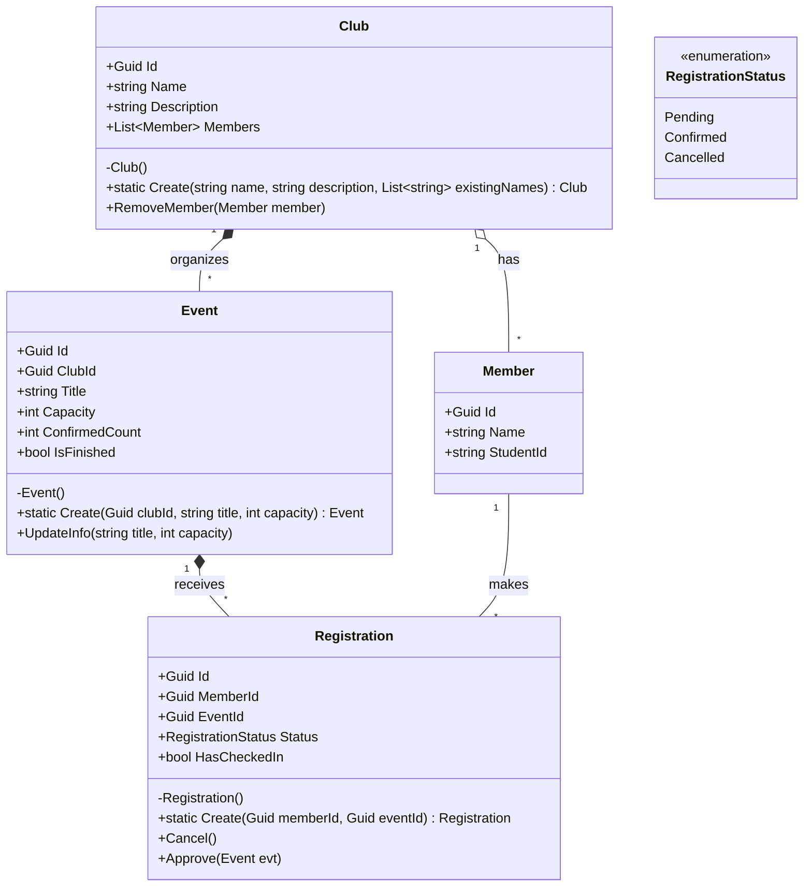

```mermaid
classDiagram
    class Club {
        +Guid Id
        +string Name
        +string Description
        +List~Member~ Members
        -Club()
        +static Create(string name, string description, List~string~ existingNames) Club
        +RemoveMember(Member member)
    }

    class Event {
        +Guid Id
        +Guid ClubId
        +string Title
        +int Capacity
        +int ConfirmedCount
        +bool IsFinished
        -Event()
        +static Create(Guid clubId, string title, int capacity) Event
        +UpdateInfo(string title, int capacity)
    }

    class Registration {
        +Guid Id
        +Guid MemberId
        +Guid EventId
        +RegistrationStatus Status
        +bool HasCheckedIn
        -Registration()
        +static Create(Guid memberId, Guid eventId) Registration
        +Cancel()
        +Approve(Event evt)
    }

    class Member {
        +Guid Id
        +string Name
        +string StudentId
    }

    class RegistrationStatus {
        <<enumeration>>
        Pending
        Confirmed
        Cancelled
    }

    Club "1" o-- "*" Member : has
    Club "1" *-- "*" Event : organizes
    Event "1" *-- "*" Registration : receives
    Member "1" -- "*" Registration : makes
```